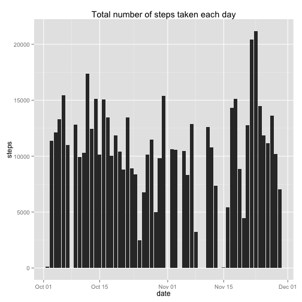
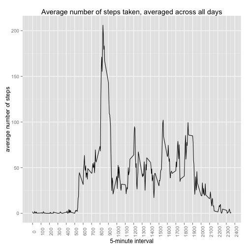
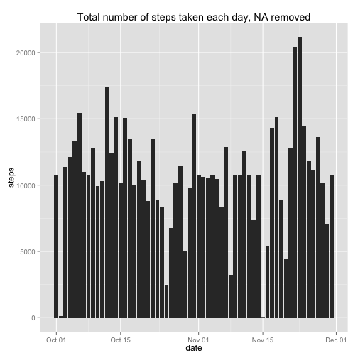
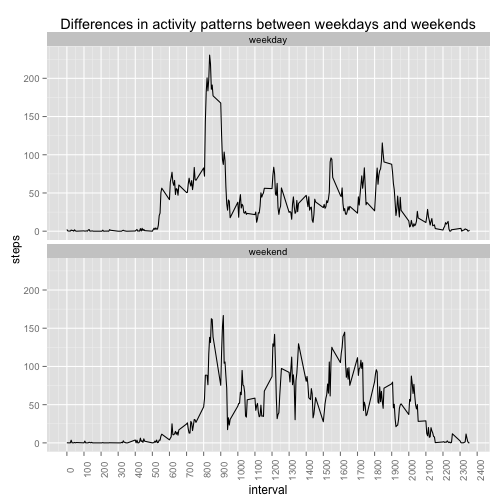

Read data that will be analyzed.


```r
library(data.table)
library(ggplot2)
library(dplyr)
df <- as.data.frame.matrix(fread("activity.csv")) #df with NA's
df$date <- as.Date(df$date, "%Y-%m-%d")

#sum steps taken by day
totalSteps <- aggregate(steps ~ date, df,sum) 
qplot(date, steps, data=totalSteps,  geom="histogram", stat="identity", 
      main= "Total number of steps taken each day") 
```

 

```r
#calculating mean and median
avgSteps <- format(round(mean(totalSteps$steps), 2), nsmall = 2)
medSteps <- format(round(median(totalSteps$steps), 2), nsmall = 2)
```

The mean of steps taken each day is 10766.19;
The median of steps taken each day is 10765.00.

###This plot shows average number of steps taken, averaged across all days, per each 5-minute interval.

```r
#calculate avg of steps taken for each interval
int <- aggregate(steps ~ interval, df, mean)

colnames(int)[2] <- "avgSteps"
ggplot(int, aes(interval, avgSteps))+geom_line() +
     scale_x_continuous(breaks=seq(0,2500, by = 100))+ 
     labs(title = "Average number of steps taken, averaged across all days",
     x="5-minute interval",
     y="average number of steps")+
     theme(axis.text.x = element_text(angle=90))
```

 

```r
maxSteps <- as.vector(int[which(int$avgSteps == max(int$avgSteps)),])
maxSteps[[2]] <- format(round(maxSteps[[2]]), nsmall = 4)
```

On average across all the days in the dataset,interval 835 contains the maximum number of steps, which is 206.0000 steps.

##Missing values difference


```r
#checking if there are missing values for analysed variable
numNA <- sum(is.na(df$steps))
```
In the analyzed data set there are 2304 missing values.
They were replaced by average number of steps per that interval.
The resulting plot is shown below.

```r
df1 <- merge(df, int, by = 'interval')
df1 <- df1[with (df1, order(date)),] # sort df by date

# replace NA values by avgSteps values
df1[which(is.na(df1$steps)),2] <- df1[which(is.na(df1$steps)),4]

#sum steps by date
totalSteps2 <- aggregate(steps ~ date, df1, sum)
head(totalSteps2)
```

```
##         date    steps
## 1 2012-10-01 10766.19
## 2 2012-10-02   126.00
## 3 2012-10-03 11352.00
## 4 2012-10-04 12116.00
## 5 2012-10-05 13294.00
## 6 2012-10-06 15420.00
```

```r
qplot(date, steps, data=totalSteps2,  geom="histogram", stat="identity",
      main= "Total number of steps taken each day, NA removed")
```

 

```r
#calculate mean and median
avgSteps2 <- format(round(mean(totalSteps2$steps), 2), nsmall = 2)
medSteps2 <- format(round(median(totalSteps2$steps), 2), nsmall = 2)
```
The mean of a new data set is 10766.19 and the median 10766.19.

Compared to initial mean 10766.19 and the median 10765.00.

##Differences in activity patterns between weekdays and weekends

To see if there are differences in activity patterns the data were split into 2 categories and two graphs were build comparing average number of steps taking in each interval

```r
df1 <- df1[,-5]
#find what day of the week is each date
df1$weekday <- weekdays(df1$date)

#classify weekends and weekdays
df1[grep("Saturday|Sunday", df1$weekday),5]<- "weekend"
df1[which(df1$weekday != 'weekend'),5] <- "weekday"

#make weekday column as a factor
df1$weekday <- as.factor(df1$weekday)

weekends <- table(df1$weekday)[[2]]
weekdays <- table(df1$weekday)[[1]]
proportion <- round((weekends/weekdays)*100, 0) 
df1 <- tbl_df(df1)
#calculate mean steps by interval and weekdays
df1 <- summarise(group_by(df1, interval,weekday), mean(steps))
colnames(df1)[3] <- "steps"

ggplot(df1,aes(x=interval, y=steps))+geom_line() +
    scale_x_continuous(breaks=seq(0,2500, by = 100))+ 
    facet_wrap(~weekday, nrow=2) +
    labs(title = "Differences in activity patterns between weekdays and weekends")+
    theme(axis.text.x = element_text(angle=90))
```

 

There is a dependency of the average number of steps across all days from average number of steps taken on weekdays. There are intervals where activity increases both in weekdays and weekends, as in interval 800-900,1200, 1550. Both weekdays and weekends share low activity on intervals 0 to 500 and starting from 2100 to 2350. Overall, the average number of steps taken through all days across all the intervals almost replicates the data from weekdays, since the proportion of weekends is 36%, which does not influence the results significantly.

